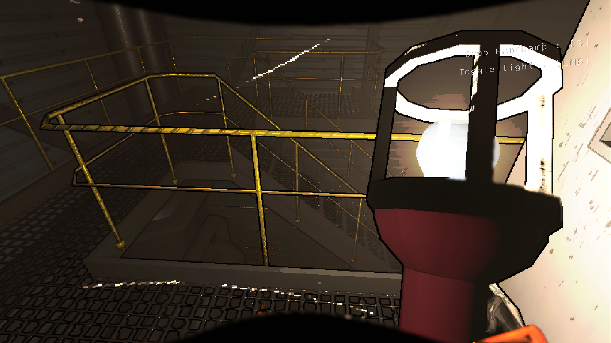
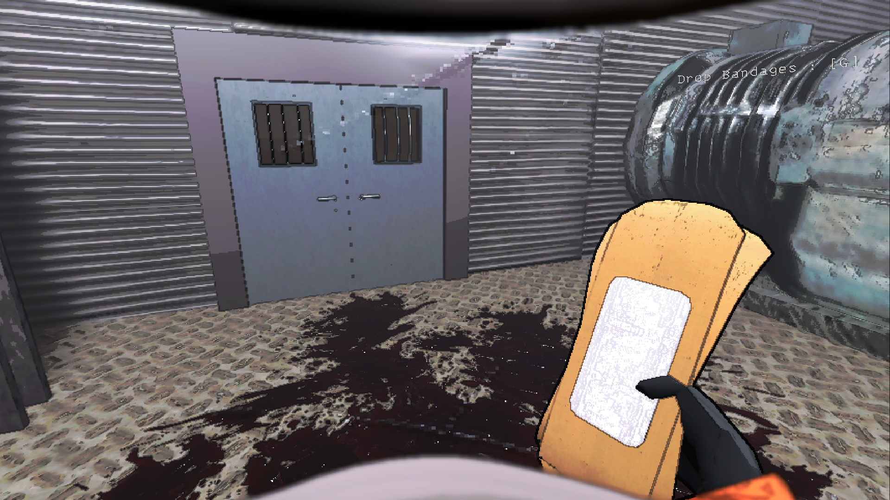
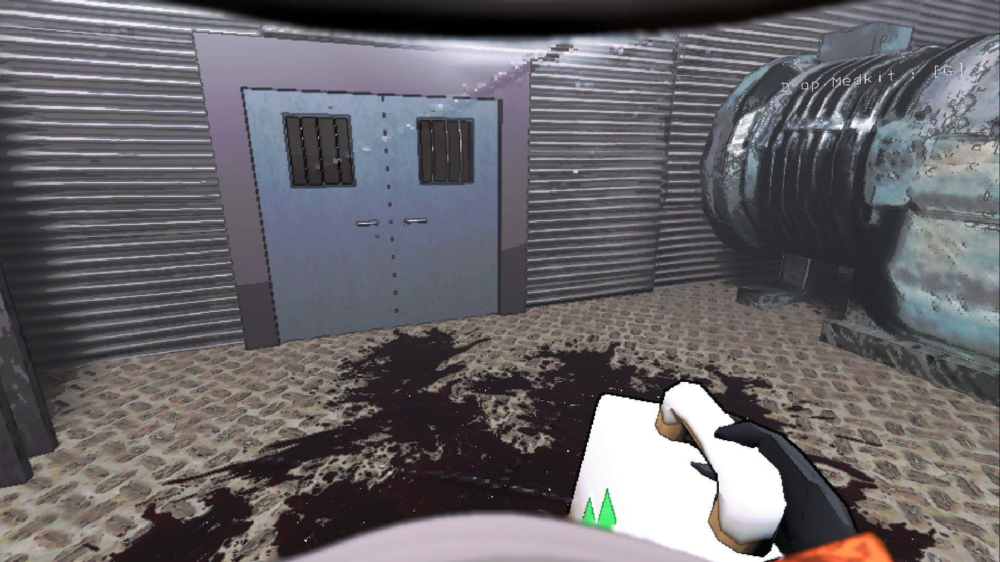
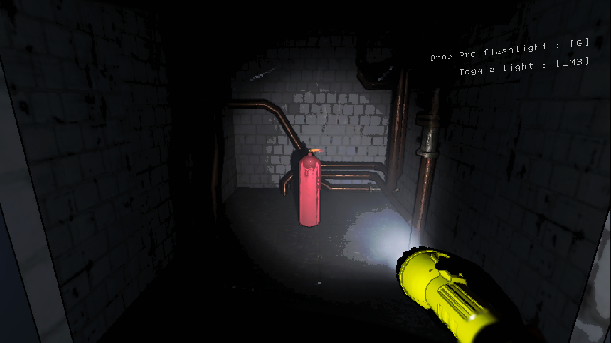
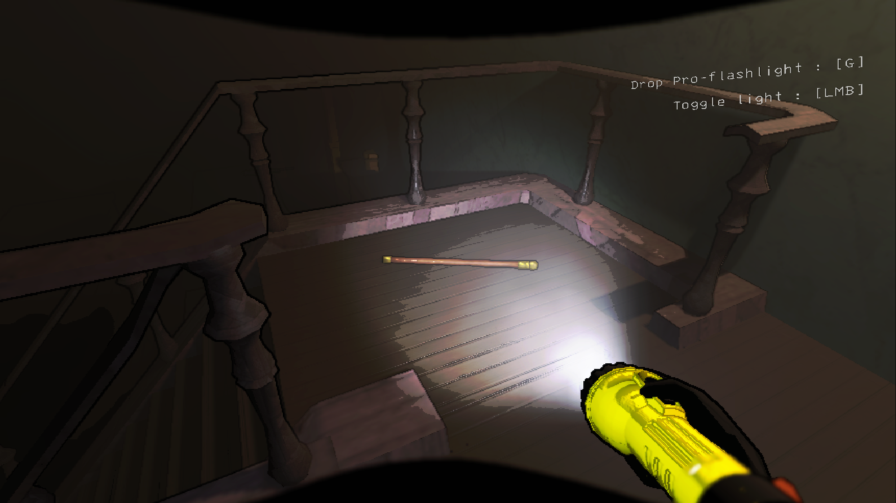

## Versions 1.3.7 and above work for v50 but most likely don't work for previous game versions anymore.
## Available Equipment

HandLamp

Costs 25 credits, Weighs 5

PROS - 
- The lamp lights up the area around the holder in a radius that is larger than a baby flashlight's light reaches but not as large as a pro-flashlight reaches in one direction.
- The lamp has a noticably larger battery capacity than the pro-flashlight.
- One-handed.

CONS - 
- The light produced by the lamp isn't as clear at long ranges as the pro-flashlight.
- The lamp's light is very bright if used in fog, gas, smoke, dust storms, etc..

Bandages

Costs 25 credits, Weighs 1

Bandages are a consumable item with 5 charges that heal 8 health each.

Unlike the medkit, Bandages heal you instantly and are a cheaper short-term option.

Medkit

Costs 150 credits, Weighs 5

The medkit gradually heals the holder using a hidden health pool that is depleted to heal.

Unlike the bandages, the medkit's base health pool can heal 6 times the health one bandage item can heal if given enough time. Additionally, its health pool can be refilled by bringing it into the ship. In the near future, I plan to add a feature that will allow players to use the medkit on their teammates without having to drop it for them.

## Unique Scrap Items

Explosive Tank (dangerous scrap item)

Once the explosive tank is picked up, an internal timer begins counting down until it reaches 0 and the tank will then explode. The only way to stop the timer is by bringing the tank inside the ship.

- Hitting the tank with a melee weapon will cause it to explode immediately.
- Each time the tank is dropped, its remaining time will be reduced by a set amount. If the tank is dropped three times, it will explode immediately.
- The internal timer can start at any time between 2 and 4 minutes.
- Spawns on any moon rarely.

Walking Cane (Useful scrap item)

Increases your move speed when held.

- Spawns on Rend, Dine, and Titan rarely.

## Basic Scrap Items

## Dependencies
1. LethalLib 
2. BepInExPack

---

Massive thanks to Malcolm on YouTube for their LC modding guides and examples.

Massive thanks to Evaisa and anyone else who has contributed to LethalLib

Massive thanks to everyone working on BepInEx

---

## Please tell me any issues or balance changes you'd like to see on my new github page.
General issues have been moved to github but I will continue to list mod capatibility interactions and issues below for easy viewing on r2modman. Also, there are pictures of the items on github if you'd like to see what they look like.

Mod Interactions

- Mods that affect flashlights may affect the handlamp.

Mod Compatability Issues

- "FlashlightExtendedRange" Makes the handlamp insanely bright when turned on.

- "Diversity" will make the handlamp brighter; it wasn't too bad the last time I tested it, but it wasn't the brightness I intended.

